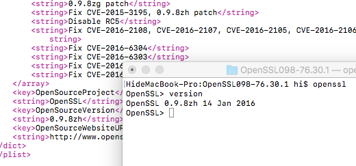

This is openssl 0.98 used by apple,patched by apple.

This is the latest version on data 2018.06.17.

Fork: [OpenSSL098](https://opensource.apple.com/source/OpenSSL098/)

### openssl 0.9.8zh at macOS 10.12.6 

<p align="center">

</p>

### USEAGE:
S
if you want to used this. Just Open openssl.xcodeproj.

if don`t have this headr file.
  
```c
#include <TrustEvaluationAgent/TrustEvaluationAgent.h> file.
```

just delete x509_vfy_apple.c at openssl.xcodeproj,

and open x509.vfy.c, uncomment the under code:

```c
/*
 * If we are using Trust Evaluation Agent, rename the original function
 */
#ifdef __APPLE__
#define X509_verify_cert X509_verify_cert_orig
#endif

```

OK! hava fun!


